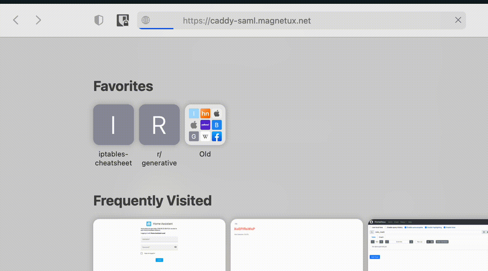

# caddy-saml-sso



A caddy module that provides SSO via SAML. For the SAML implementation we use [this](https://github.com/crewjam/saml) wonderful library.

Just write your app behind Caddy with the module enabled and Caddy will proxy the request to your app only if
the user has a valid SAML session.

When enabling this module on your routes, if the SAML flow is successful, you will have all the SAML attributes in the header so your
application can access them.

## Process to use it.

1. We want the caddy server with this module enabled (see build).
2. Use the .env.dev to setup the details of your SAML idp.
3. Run caddy using the Caddyfile as a reference. Test the root path to make sure all works correctly.

You also can run all this within docker: one container for Caddy another one for your application.
See [docker-compose.yml](docker-compose.yml) for more details.

## Build

`make build` will caddy with the plugin.

`make saml-cert` will create a directory with the cert and key necessary to sign xml documents.

## Caddyfile example

```Caddy
(enable_saml) {
  saml_sso {
 		saml_idp_url   {$SAML_IDP_URL}
		saml_cert_file {$SAML_CERT_FILE}
		saml_key_file  {$SAML_KEY_FILE}
		saml_root_url  {$SAML_ROOT_URL}
  }
}

https://foo.bar.net:12000 {
  handle /ping {
    respond "pong"
  }

  handle /* {
    route /* {
      import enable_saml
      respond "you are authenticated now."
    }
  }
}
```

In this Caddyfile we have a TLS server on `foo.bar.net:12000`.
The first handler `/ping` is not protected and we use it for testing.
The second handler handles the rest of the traffic. It loads the saml_sso
plugin and runs the middleware it provides.

The middleware passes SAML requests (`/saml`) to the SAML library. For other
paths, it runs the SAML middleware to make sure that each requests has a valid
SAML session. If not, it will redirect the user.

If all goes well, caddy will continue with the next middleware, in this case we
send an "ok" back. Here you probably want to redirect all traffic to your app
server.

## Testing

If you want to test locally I suggest you use the [samltest idp](https://samltest.id/).

1. If you are running the server (caddy) in your local machine you are
   going to have some kind of [tunnel](https://developers.cloudflare.com/cloudflare-one/connections/connect-apps)
   setup to map the https traffic to your local machine.

2. Create a .env.dev in the root of the project with:

```sh
SAML_IDP_URL=https://samltest.id/saml/idp
SAML_CERT_FILE=saml-cert/service.cert
SAML_KEY_FILE=saml-cert/service.key
SAML_ROOT_URL=https://caddy-saml.mydomain.net
DOMAIN=caddy-saml.mydomain.net
```

You probably only want to change the last two values.

3. Start the server `make` and get your SPs metadata:

```sh
$ make metadata > /save/here.xml
```

4. Head over [samltest.id](https://samltest.id/) and upload your metadata.
   Now you have established the trust between your SP and the IDP.

5. Fire up your browser and point it to: `$(SAML_ROOT_URL)`. If all goes well
   the SAML flow should keep in and you will be asked to enter a
   login and password then, if the credentials are correct (the credentials are
   in the webpage you just have to copy them) the IDP will redirect the browser
   to root page of your SP.
